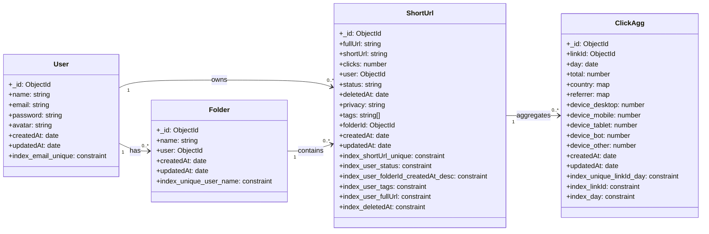

## Database Schema

```mermaid
classDiagram
direction LR

class User {
  +_id: ObjectId
  +name: string
  +email: string
  +password: string
  +avatar: string
  +createdAt: date
  +updatedAt: date
  +index_email_unique: constraint
}

class Folder {
  +_id: ObjectId
  +name: string
  +user: ObjectId
  +createdAt: date
  +updatedAt: date
  +index_unique_user_name: constraint
}

class ShortUrl {
  +_id: ObjectId
  +fullUrl: string
  +shortUrl: string
  +clicks: number
  +user: ObjectId
  +status: string
  +deletedAt: date
  +privacy: string
  +tags: string[]
  +folderId: ObjectId
  +createdAt: date
  +updatedAt: date
  +index_shortUrl_unique: constraint
  +index_user_status: constraint
  +index_user_folderId_createdAt_desc: constraint
  +index_user_tags: constraint
  +index_user_fullUrl: constraint
  +index_deletedAt: constraint
}

class ClickAgg {
  +_id: ObjectId
  +linkId: ObjectId
  +day: date
  +total: number
  +country: map
  +referrer: map
  +device_desktop: number
  +device_mobile: number
  +device_tablet: number
  +device_bot: number
  +device_other: number
  +createdAt: date
  +updatedAt: date
  +index_unique_linkId_day: constraint
  +index_linkId: constraint
  +index_day: constraint
}

User "1" --> "0..*" ShortUrl : owns
User "1" --> "0..*" Folder : has
Folder "1" --> "0..*" ShortUrl : contains
ShortUrl "1" --> "0..*" ClickAgg : aggregates
```
